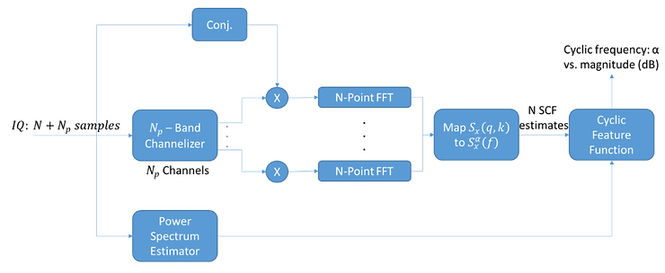

# rustycyclo

Strip Spectral Correlation Analyzer (SSCA) implementation CUDA wrapped inside a Rust interface.

## Simple usage example (from docs)

Check `examples` folder.

## Development environment

Since this repository compiles CUDA code, it needs a specific `nvcc` compiler to build along with `cargo`. The `Dockerfile` in the root of this repository can be used to create a container that can be used to develop and compile the library. Use `docker compose up` to bring up the container.
Then `docker exec -it <container_id> /bin/bash`. `cargo` can be used as normal inside the container.

## Benchmarks

`cargo bench` inside the `analyzer` folder to run the `analyzer` benchmarks. The provided benchmarks runs at `~40 MSamples/sec` on an NVIDIA A10 GPU with a server-class Xeon CPU. On a `NVIDIA GeForce GTX 1070` GPU, we get `21 MSamples/sec`.
